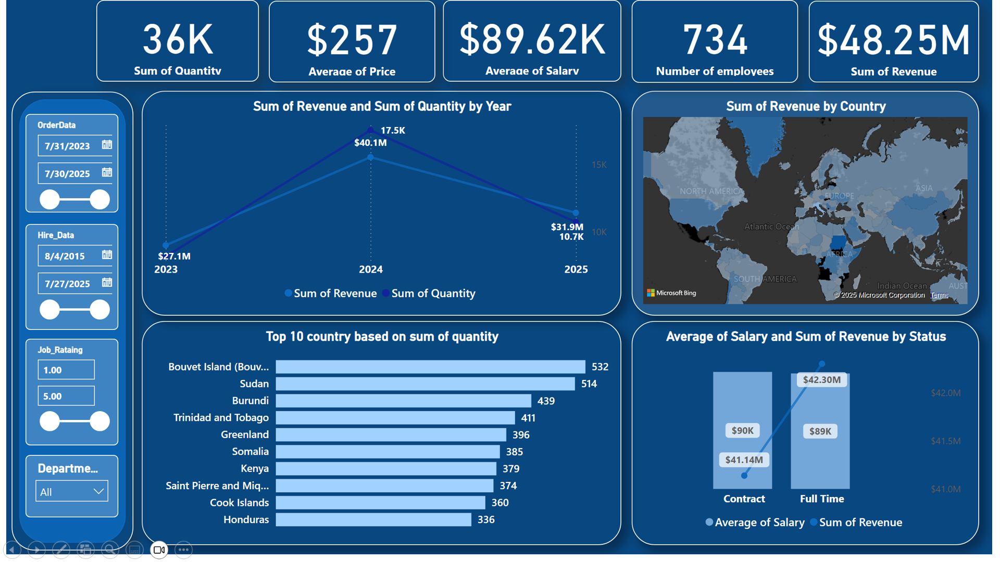

# 📊 Sales Insights Dashboard

This Power BI dashboard provides a comprehensive analysis of business sales data. It helps in understanding overall performance, identifying trends, and supporting data-driven decisions.

---

## 🗂️ Project Description

The **Sales Insights Dashboard** is designed to give business stakeholders a clear view of key sales metrics. The dashboard includes dynamic visualizations and interactive filters to explore the data from multiple angles.

---

## 📁 Data Source

- Internal business dataset (imported via Excel or CSV)
- Contains: Product Sales, Customer Data, Revenue, Profit, Employee Info

---

## 🖼️ Dashboard Preview



> 📌 *To view the full interactive dashboard, open the `.pbix` file in Power BI Desktop.*

---

## 📌 Key Insights

- 🏷️ **Total Quantity Sold:** 36K
- 💰 **Average Price:** $257
- 💵 **Average Salary:** $89.6K
- 👥 **Number of Employees:** 734
- 🏆 **Total Revenue:** $48.25M
- 🌍 **Revenue & Quantity by Country**
- ⏳ **Revenue Trends Over Time**
- 📊 **Revenue by Employment Status**

---

## 🛠️ Tools Used

- **Power BI Desktop**
- DAX for custom calculations
- Power Query for data transformation

---

## 🚀 How to Use

1. Clone the repository:
   ```bash
   git clone https://github.com/your-username/sales-insights-dashboard.git
